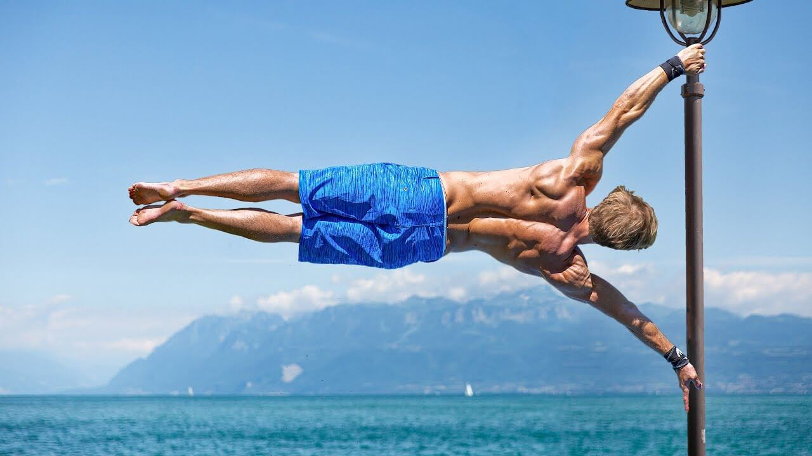

**About Me**
Hello! My name is Yangken and I'm currently a student at NUS studying computer science.

This page is meant for me to document my progress in calisthenics and my experiences along this journey!

Calisthenics is a form of exercise that simply requires your bodyweight and can be performed anywhere.
It's catered for anyone and there's always a place to start!

Personally, my first exposure to Calisthenics was when back in secondary school when I was 15.
I saw this guy perform a move where he held his body perpendicular to a pole (which I later learnt was called
a human flag). This was pretty insane to me at the time and I was just thinking about the level of strength required
especially since he was only a year older.

A human flag in action!

This was my first time seeing this and needless to say, it sparked off my interest for picking up this unique set of skills.